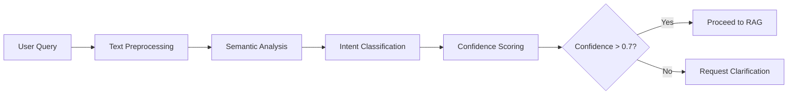
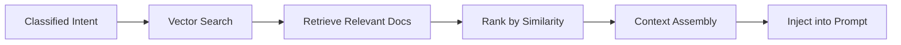
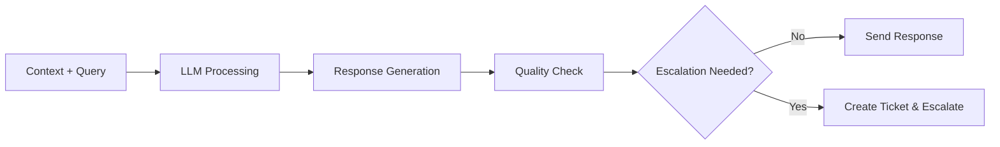

# 🤖 Adaptive Customer Support Agent

[
- [✨ Key Features](#-key-features)
- [🏗️ System Architecture](#️ Stack](#️-tech-stack)
- [📁 Project Structure](#-project-structure)
- [⚡ Quick Start](#-quick-start)
- [🔧 Installation](#-installation)
- [🐳 Docker Deployment](#-docker-deployment)
- [📊 Agent Workflow](#-agent-workflow)
- [🎯 Banking Intents](#-banking-intents)
- [🔌 API Documentation](#-api-documentation)
- [🧪 Testing](#-testing)
- [📈 Monitoring & Observability](#-monitoring--observability)
- [🚀 Production Deployment](#-production-deployment)
- [🤝 Contributing](#-contributing)
- [📝 License](#-license)

## 🚀 OverviewThe **Adaptive Customer Support Agent** is a sophisticated AI-powered solution designed to handle customer inquiries in the banking and financial services sector. This system combines the power of Large Language Models (LLMs), Retrieval-Augmented Generation (RAG), and intelligent agent orchestration to provide accurate, contextual, and professional customer support.

### 🎯 Why This Solution?Traditional customer support systems often struggle with:
- **Inconsistent responses** across different agents
- **Limited availability** outside business hours
- **High operational costs** for human agent training
- **Slow response times** during peak periods
- **Knowledge fragmentation** across multiple systems

Our Adaptive Customer Support Agent addresses these challenges by:
- ✅ **24/7 Availability** with instant response times
- ✅ **Consistent Service Quality** across all interactions
- ✅ **Intelligent Escalation** to human agents when needed
- ✅ **Context-Aware Responses** using conversation memory
- ✅ **Continuous Learning** from customer interactions

## ✨ Key Features### 🧠 **Intelligent Agent System**
- **Multi-Agent Architecture**: Specialized agents for intent classification, conversation handling, knowledge retrieval, and escalation
- **Stateful Workflows**: Built with LangGraph for complex, multi-step interactions
- **Context Retention**: Maintains conversation history and customer context across interactions

### 🔍 **Advanced RAG Implementation**
- **Semantic Search**: FAISS-powered vector database for accurate knowledge retrieval
- **Dynamic Context Injection**: Real-time knowledge base querying during conversations
- **Relevance Scoring**: Intelligent ranking of retrieved information

### 💬 **Conversational AI**
- **Intent Classification**: 23+ banking-specific intents with high accuracy classification
- **Natural Language Understanding**: Advanced NLP for query comprehension
- **Professional Tone**: Consistent, banking-appropriate communication style

### 🔄 **Smart Escalation**
- **Automated Triggers**: Rule-based and ML-driven escalation decisions
- **Context Preservation**: Complete conversation history transferred to human agents
- **Ticket Management**: Integrated ticketing system for tracking escalated cases

### 📊 **Data Management**
- **MongoDB Integration**: Scalable conversation and user data storage
- **Redis Caching**: High-performance memory layer for session management
- **Vector Storage**: Optimized embedding storage and retrieval

## 🏗️ System Architecture### Core ComponentsThe system follows a **modular, microservices-inspired architecture** with clear separation of concerns:

#### 🌐 **Presentation Layer**
- **Streamlit UI**: Interactive web interface for demonstrations
- **FastAPI Endpoints**: RESTful API for integration with external systems
- **Multi-Channel Support**: Web, mobile, and API client compatibility

#### 🤖 **Agent Orchestration Layer**
- **Intent Classifier Agent**: Determines customer query intent with confidence scoring
- **Conversation Agent**: Manages dialogue flow and response generation
- **RAG Agent**: Retrieves relevant knowledge base articles
- **Escalation Agent**: Handles complex scenarios requiring human intervention

#### ⚙️ **Core Services Layer**
- **LLM Client**: OpenAI GPT-4 integration with retry logic and error handling
- **Vector Store Manager**: FAISS/Chroma integration for semantic search
- **Database Manager**: MongoDB operations with connection pooling
- **Memory Manager**: Redis-based session and context management

#### 💾 **Data Layer**
- **Knowledge Base**: Comprehensive banking domain expertise
- **Customer Data**: Secure storage of customer interaction history
- **Intent Patterns**: Training data for intent classification
- **Conversation Logs**: Complete audit trail of all interactions

## 🛠️ Tech Stack### 🧠 **AI & Agent Frameworks**
```yaml
Core AI Technologies:
  - LangChain: ```.0+          # Composable AI chains```d tool abstraction
  - LangGraph: 0.0.46+         # Stat```l agentic workflows
  - OpenAI GPT-4: 1.30.1+      # Large```nguage model for responses
  - Sentence```ansformers: 2.7.0+  # Intent classification embeddings
```

### 🔧 **Backend & Infrastructure**
```yaml
Application```amework:
  - FastAPI: ```11.0+          ```igh-performance async API framework
  - Python: 3.11+              # Core programming language
  - Uvicorn: 0.29.0+           # ASGI```rver for production deployment
  - Asyncio: Built-in          # Concurrent```sk orchestration
```

### 🗃️ **Data & Storage**
```yaml
Databases:
  - MongoDB: ```+              # Document```orage for conversations
  - Redis: 7.0+                # In-memory cache```r sessions
  - FAISS: ```.0+              # Vector database for semantic search
  - Chroma: 0.5.2+             # Alternative vector store option````

### 🔌 **DevOps & Monitoring**
```yaml
Development```Deployment:
  - Docker:```test             # Containerization platform
  - Azure DevOps: CI/CD        #```ntinuous integration and deployment
  - LangSmith: 0.1.28+         ```LM observability and debugging
  - Pytest: 8.2.0+            ```omprehensive testing framework
```

## 📁 Project Structure```
adaptive```stomer-support-agent/
├── 📁 src/                              # ```ource code directory```  ├── 📁 agents/                       # ```I agent implementations
│   │   ├── intent_classifier.py         # ```ntent classification logic
│   │   ├──```nversation_agent.py        # 💬 Main```nversation handler
│   │   ├──```calation_agent.py          # ```uman escalation logic
│   │   ``` rag_agent.py                 # 🔍```G implementation
│   ├── ```outing/                      # ```Request routing logic
│   │   ├──```rkflow_router.py           # ```ain workflow routing
│   │   └── intent```uter.py             # 🎯 Intent-based routing
│   ├── 📁 core/                         ```️ Core utilities
│   │   ├──```nfig.py                    # 🔧 Configuration management
│   │   ├── database.py                  # ```MongoDB operations
│   │   ├```vector_store.py              # 📊 ```SS vector operations
│   │   ├──```m_client.py                # ```penAI integration
│   │   └── memory```                    # 💾 ```ory management
│   ├── 📁 channels/                     # 📡 ```r interface channels
│   │   ├```fastapi_channel.py           # 🚀 FastAPI endpoints```  │   └── streamlit_channel.py         # 🎨 Stream``` UI integration
│   ├── 📁 tools/                        # ```Domain-specific tools
│   │   ``` banking_tools.py             # 🏦```nking operations
│   │   ├──```owledge_base.py            # 📚 Knowledge retri```l
│   │   └── customer```ols.py            # ```ustomer data```ols
│   └── 📁 data/                ```      # 📋 Data files```      ├── banking```tents.json         ``` Intent definitions
│       ├── sample```nking_data.json     # ```ample customer data
│       └── knowledge```se.json          # 📖```owledge articles
├── 📁 tests```                          # 🧪 ```prehensive test suite
│   ├── test```ents.py                   # ```gent behavior tests
│   ├── test```uting.py                  # 🛣```outing logic tests
│   ├── test```ols.py                    # ```Tools functionality tests
│   └── test```tegration.py              ``` End-to-end integration tests
├── 📁 docker```                         # 🐳 Docker configuration
│   ├── Dockerfile                       # 📦 Container definition
│   ├── docker-compose.yml               # 🚢```lti-container setup
│   └── requirements.txt                 # 📋 Container```pendencies
├── 📁 ui/                               # 🎨 User```terface components
│   ├── stream```_app.py                 # ```Streamlit application
│   └── 📁 static/                       # ```tatic assets
├── 📁 docs/                ```          # 📚 Documentation
│   ├── ARCHITECTURE.md                  # ```System architecture guide```  ├── DEPLOYMENT```                    # 🚀 ```loyment instructions
│   └── API```CS.md                      # ```PI documentation
├── main.py                              # ```pplication entry point
├── requirements.txt```                  # 📋 Python dependencies
├── .env.example                         # 🔧 Environment template```─ azure-pipelines.yml                 # ```I/CD configuration
└── README.md                            ``` This file
```

## ⚡ Quick Start### 🚀 **1-Minute Demo Setup**```bash
# Clone the```pository
git clone https://github.com/yourusername/adaptive-customer-support-agent.git
cd adaptive-customer-support-agent

# Set up environment
cp .env.example .env```Edit .env with your API keys``` Quick start with Docker
docker-compose -f docker/docker-compose.yml``` -d

# Access the application
echo "🎉 Application running at:"
echo "📱 FastAPI: http://localhost:8000"
echo "🎨 Streamlit: http://localhost```01"
```

### 🎯 **Test the System**```bash
# Test intent classification
curl -X POST "http```localhost:8000/api/v1/classify"```  -H "Content-Type: application/json" \
  -d '{"text": "I need to```ock my credit card"}'

# Test conversation```rl -X POST "http://localhost:8000/api/v1/chat" \
  -H "Content-Type: application/json" \
  -d '{"session_id": "test-123", "message```"What is my account balance?"}'
```

## 🔧 Installation### 📋 **Prerequisites**- **Python 3.11+** installed on your system
- **OpenAI API Key** for GPT-4 access
- **MongoDB** instance (local or cloud)
- **Redis** server (optional, for caching)
- **Git** for version control

### 🛠️ **Step-by-Step Installation**#### **1. Environment Setup**

```bash
# Create and activate virtual environment
python -m venv venv

# Activate virtual environment
# On Windows:
venv\Scripts\activate```On macOS/Linux:
source venv/bin/activate``` Upgrade pip
python -m pip install --upgrade pip````

#### **2. Install Dependencies**

```bash
# Install```l required packages
pip install -r requirements.txt

# Verify installation
python -c "import langchain, open``` fastapi; print('✅ All packages```stalled successfully!')"
```

#### **3. Configuration**

```bash
# Create environment```le
cp .env.example .env

# Edit configuration (replace with your actual```lues)
nano .env````

**Required Environment Variables:**
```env
# OpenAI Configuration```ENAI_API_KEY=your-openai-api-key-here
OPENAI_API```SE=https://api.openai.```/v1

# Database```nfiguration
MONGODB_URI=mongodb://localhost:27017
MONGODB_DATABASE=adaptive_support

# Redis Configuration```ptional)
REDIS_URL=redis://localhost:6379

# Vector Store Configuration
VECTOR_STORE=```ss
VECTOR_DIRECTORY=./```/data/faiss_index
```

#### **4. Database Setup**

```bash
# Start MongoDB (if running locally)
mongod --dbpath /path/to/your```

# Start Redis (if using```ching)
redis-server

# Initialize vector store
python -c "
from src.core.vector_store import init```ctor_store
import asyncio
asyncio.run(init_vector_```re())
print('✅ Vector store initialized!')
"
```

#### **5. Run the Application**

```bash
# Start FastAPI server
python main.py

# Or run with uvicorn directly
uvicorn main:app --reload --port 8000

# Start Streamlit UI (separate terminal)
streamlit run src/channels/streamlit_channel.py --server.port 8501
```

## 🐳 Docker Deployment### 🚢 **Container Orchestration**The application includes a comprehensive Docker setup with multi-service orchestration:

#### **Development Environment**

```bash
# Build and start all services
docker-compose -f docker```cker-compose.yml up --build

# Run in background
docker-compose -f docker/```ker-compose.yml up -d

# View logs
docker-compose -f docker/docker-compose.yml logs -f app

# Stop all services
docker-compose -f docker/docker-compose.``` down
```

#### **Production Deployment**

```bash
# Build production image
docker build -f docker/Dockerfile -t adaptive-support:latest .

# Run with production settings```cker run -d \
  --name adaptive-support-prod \
  -p 8000:8000 \
  --env-file .env \
  adaptive-support:latest

# Health```eck
curl http://localhost:8000/docs
```

#### **Container Configuration**

The Docker setup includes:
- **Multi-stage builds** for optimized image size
- **Health checks** for service monitoring
- **Volume mounts** for persistent data
- **Network isolation** for security
- **Environment-based configuration**

**Services included:**
- 🚀 **App**: Main FastAPI application
- 🗄️ **MongoDB**: Document database
- 💾 **Redis**: Memory cache
- 📊 **Vector Store**: FAISS index storage

## 📊 Agent Workflow### 🔄 **Conversation Flow**The agent system follows a sophisticated workflow designed to handle customer queries efficiently:

#### **Phase 1: Intent Classification**


#### **Phase 2: Knowledge Retrieval**


#### **Phase 3: Response Generation**


### 🎯 **Decision Points**The system makes intelligent decisions at key points:

1. **Intent Recognition**: High-confidence classification vs. clarification request
2. **Context Relevance**: Relevant knowledge available vs. general response
3. **Response Quality**: Satisfactory answer vs. escalation trigger
4. **Customer Satisfaction**: Continue conversation vs. end session

### 📈 **Performance Optimization**- **Caching**: Frequent queries cached in Redis for instant responses
- **Batch Processing**: Multiple queries processed simultaneously
- **Connection Pooling**: Efficient database connection management
- **Async Operations**: Non-blocking I/O for high concurrency

## 🎯 Banking Intents### 📋 **Supported Intent Categories**Our system handles **23+ specialized banking intents** across key service areas:

#### 🏦 **Account Management**
| Intent | Description | Example Queries |
|--------|-------------|-----------------|
| `account_balance` | Check current account balance | "What's my balance?", "How much money do I have?" |
| `account_details` | View account information | "Show me my account details", "What's my account number?" |
| `account_history` | View account activity | "Show my account history", "What transactions happened?" |

#### 💳 **Card Services**
| Intent | Description | Example Queries |
|--------|-------------|-----------------|
| `card_block` | Block/freeze payment cards | "Block my card", "My card is lost, freeze it" |
| `card_activate` | Activate new cards | "Activate my new debit card", "How do I activate my card?" |
| `card_replacement` | Request card replacement | "I need a new card", "Replace my damaged card" |
| `card_limit` | Check/modify spending limits | "What's my card limit?", "Increase my spending limit" |

#### 💰 **Transactions & Payments**
| Intent | Description | Example Queries |
|--------|-------------|-----------------|
| `recent_transactions` | View recent transactions | "Show my last transactions", "What did I spend on?" |
| `transfer_money` | Internal money transfers | "Transfer money to savings", "Move funds between accounts" |
| `payment_status` | Check payment status | "Did my payment go through?", "Is my bill paid?" |
| `recurring_payments` | Manage automatic payments | "Cancel my subscription payment", "Set up auto-pay" |

#### 🏠 **Loans & Credit**
| Intent | Description | Example Queries |
|--------|-------------|-----------------|
| `loan_balance` | Check loan balances | "How much do I owe on my mortgage?", "Loan balance check" |
| `loan_payment` | Make loan payments | "Pay my car loan", "When is my next payment due?" |
| `credit_score` | View credit information | "What's my credit score?", "Check my credit report" |
| `loan_application` | Apply for new loans | "I want to apply for a home loan", "Personal loan application" |

#### 🔒 **Security & Fraud**
| Intent | Description | Example Queries |
|--------|-------------|-----------------|
| `fraud_report` | Report suspicious activity | "I see unauthorized charges", "Someone used my card" |
| `security_alert` | Security notifications | "Why did I get a security alert?", "Is this transaction real?" |
| `password_reset` | Reset login credentials | "I forgot my password", "Reset my online banking login" |
| `identity_verification` | Verify customer identity | "How do I verify my identity?", "Authentication help" |

#### 🌐 **Digital Banking**
| Intent | Description | Example Queries |
|--------|-------------|-----------------|
| `mobile_app` | Mobile banking support | "App won't work", "How to use mobile banking?" |
| `online_banking` | Web banking assistance | "Can't log into my account", "Online banking help" |
| `digital_wallet` | Digital payment methods | "Add card to Apple Pay", "Google Pay setup" |

#### 🏢 **Branch & ATM Services**
| Intent | Description | Example Queries |
|--------|-------------|-----------------|
| `branch_locator` | Find nearby branches | "Where's the nearest branch?", "Bank locations near me" |
| `atm_locator` | Find ATM locations | "ATM near me", "Where can I withdraw cash?" |
| `branch_hours` | Operating hours | "What time does the branch close?", "Are you open today?" |

### 🎨 **Intent Classification Features**

#### **High Accuracy Classification**
- **Semantic Understanding**: Uses sentence transformers for deep meaning comprehension
- **Confidence Scoring**: Each classification includes confidence percentage
- **Fallback Handling**: Graceful degradation for ambiguous queries
- **Multi-language Support**: Extensible for multiple languages

#### **Continuous Learning**
- **Feedback Loop**: Learns from human agent corrections
- **Pattern Recognition**: Identifies new query patterns automatically
- **Model Updates**: Regular retraining with new customer data
- **A/B Testing**: Compare different classification approaches

## 🔌 API Documentation### 📡 **FastAPI Endpoints**The system exposes a comprehensive RESTful API for integration with external systems:

#### **🗣️ Chat Endpoints**

##### `POST /api/v1/chat`
Primary conversation endpoint for customer interactions.

**Request Body:**
```json
{
  "session_id": "unique-session-identifier```  "message": "User query text```  "metadata": {
    "channel```"web|mobile|api",
    "customer```": "optional-customer-id",
    "priority```"normal|high|urgent"
  }
}
```

**Response:**
```json
{
  "reply": "Agent response text",
  "intent```"classified_intent",
  "confidence": ```5,
  "escal```d": false,
  "ticket```": null,
  "context```ed": ["doc1", "doc2"],
  "response_time_ms": 245
}
```

**Example Usage:**
```bash
curl -X POST "http://localhost:8000/api/v1/chat" \
  -H "Content```pe: application/json" \
  -d '{
    "session_id": "```s_12345",
    "message```"I want to check my account balance"```}'
```

#### **🎯 Intent Classification**

##### `POST /api/v1/classify`
Standalone intent classification for analytics and testing.

**Request Body:**
```json
{
  "text":```uery to classify",
  "return```ternatives": true,
  "threshold": 0.5
}
```

**Response:**
```json
{
  "intent```"account_balance",
  "confidence": 0.92,
  "alternatives": [
    {"intent": "account_details", "confidence": 0.15},
    {"intent": "recent_transactions", "confidence": 0.08}
  ],
  "processing_time_ms": 45
}
```

#### **📊 Session Management**

##### `GET /api/v1/sessions/{session_id}`
Retrieve conversation history for a session.

**Response:**
```json
{
  "session_id": "sess_12345",
  "create```t": "2025-07-24T11:43:00Z",
  "last_activity": "2025-07-24T11:45:30Z",
  "message```unt": 8,
  "escal```d": false,
  "customer_i``` "cust_67890",
  "messages``` [
    {
      "role": "user",
      "content": "Hello, I need help",
      "timestamp": "2025-07-24T11:43:00Z"
    },
    {
      "role": "assistant", 
      "content": "Hello! How can I help you today?",
      "timestamp": "2025-07-24T11:43:02Z",
      "intent": "greeting"
    }
  ]
}
```

##### `DELETE /api/v1/sessions/{session_id}`
End a conversation session and clean up resources.

#### **🚨 Escalation Management**

##### `GET /api/v1/escalations`
List escalated tickets (admin endpoint).

**Query Parameters:**
- `status`: `open|in_progress|resolved`
- `priority`: `normal|high|urgent`
- `limit`: Maximum results (default: 50)
- `offset`: Pagination offset

**Response:**
```json
{
  "tickets": [
    {
      "ticket_id": "TCK-A1B2C3D4",
      "session_id": "sess_12345",
      "created_at": "2025-07-24T11:43:00Z",
      "priority": "high",
      "status": "open",
      "customer_message": "Original user query",
      "ai_response": "Last AI response",
      "escalation_reason": "Complex query requiring human expertise"
    }
  ],
  "total": 1,
  "has_more": false
}
```

#### **📈 Analytics Endpoints**

##### `GET /api/v1/analytics/intents`
Intent classification statistics.

**Response:**
```json
{
  "period": "24h",
  "total_queries": 1250,
  "intent_distribution": {
    "account```lance": 320,
    "card_block```180,
    "recent```ansactions": 150,
    "fraud_report": 95
  },
  "average```nfidence": 0.87,
  "escal```on_rate": 0.08
}
```

##### `GET /api/v1/analytics/performance`
System performance metrics.

**Response:**
```json
{
  "average_response_time_ms": ```,
  "queries_per_second": 12.5,
  "cache_hit_rate": 0.78,
  "uptime_percentage": 99.95,
  "active_sessions": 45,
  "error_rate": 0.002
}
```

### 🔒 **Authentication & Security**#### **API Key Authentication**
```bash
curl -X POST "http```localhost:8000/api/v1/chat" \
  -H "Authorization```earer your-api-key" \
  -H "Content-Type: application/json```
  -d '{"session_id": "sess_```", "message": "Hello"}'
```

#### **Rate Limiting**
- **Per-IP Limits**: 100 requests per minute
- **Per-API-Key Limits**: 1000 requests per minute
- **Burst Handling**: Temporary spikes accommodated
- **Graceful Degradation**: Queue management during high load

#### **Security Headers**
- **CORS**: Configurable cross-origin policies
- **HTTPS**: TLS encryption for all communications
- **Input Validation**: Comprehensive request sanitization
- **Output Filtering**: Sensitive data protection

## 🧪 Testing### 🔬 **Comprehensive Test Suite**The project includes extensive testing across all system components:

#### **🏃‍♂️ Running Tests**

```bash
# Run all tests
pytest

# Run with coverage report```test --cov=src --cov-report=html --cov-report=term

# Run specific test categories```test tests/test_agents.py          ```gent behavior tests
pytest tests/test_integration```     # End-to-end tests
pytest tests```st_api.py             # API endpoint```sts

# Run with verbose output
pytest -v --tb=short

# Run tests in```rallel
pytest -n auto                      # Requires```test-xdist
```

#### **🧪 Test Categories**

##### **Unit Tests** (`tests/test_agents.py`)
```python
# Example: Intent classification accuracy```f test_intent_classifier_banking```eries():
    classifier = get```tent_classifier()
    
    test```ses = [
        ("Block my debit card immediately", "card_block", 0.8),
        ("What's my current balance?", "account_balance", 0.9),
        ("I see suspicious transactions", "fraud_report", 0.85)
    ]
    
    for query, expecte```ntent, min_confidence in test_cases:```      intent, confidence = classifier.classify(query)
        assert intent == expected_intent
        assert confidence >= min_confidence````

##### **Integration Tests** (`tests/test_integration.py`)
```python
# Example:```d-to-end conversation flow
@pytest.mark.asyncio
async def test_complete```nversation_flow():
    # Test```ll workflow from user query to agent```sponse
    session_id = "test_session_```"
    user```ssage = "I need to```eck my recent transactions"
    
    # Sen```equest through FastAPI
    response = await test```ient.post("/api/v1/chat", json```        "session_id": session_id,
        "message```user_message
    })
    
    assert```sponse.status_code == 200
    data = response.json()
    
    # Verify response structure```  assert "reply" in data
    assert "intent" in data```  assert data["intent"] == "recent_transactions"
    assert data["confidence"] > 0.7
    
    # Verify conversation stored in database
    session```await db.conversations.find_one({"session_```: session_id})
    assert session is```t None
    assert len(session["messages"]) >= 2  # User + AI messages
```

##### **Performance Tests** (`tests/test_performance.py`)
```python
# Example: Load testing
@pytest.mark.async```async def test_concurrent_requests():
    # Test system```der load
    import asyncio
    
    async def```nd_request(session_id):
        response```await test_client.post("/api/v1/chat", json```            "session_id": f```ad_test_{session_id}",
            "message": "What``` my balance?"
        })
        return response```on()
    
    # Send 100 concurrent requests
    tasks```[send_request(i) for i in range(100)]
    responses = await asyncio.gather(*tasks)
    
    # Verify```l requests succeeded
    assert len(responses) == 100
    assert all(r.get("reply") for r in responses)
    
    # Check response times (should be under 2 seconds)
    response_times = [r.get("response_time_ms", 0) for r in responses]
    average_time = sum(response_times) / len(response_times)
    assert average_time  tuple[str, float]:
    """
    Classify user intent from natural language text.
    
    Args```       text: User query string to classify
        
    Returns:```      Tuple of (intent_name, confidence_score)
        ```  Raises:
        ValueError: If text``` empty or invalid
        
    Example:
        >>> intent```onfidence = classify_intent("Block my```rd")
        >>> assert```tent == "card_block"
        >>> assert confidence```0.8
    """
    if not text.strip():
        raise ValueError("Input text cannot be empty")
        
    # Implementation```re...
    return intent_```e, confidence_score
```

##### **Testing Requirements**
- **Unit Tests**: All new functions must have unit tests
- **Integration Tests**: API endpoints require integration tests
- **Performance Tests**: New features should include performance benchmarks
- **Coverage**: Maintain >90% code coverage

##### **Documentation Standards**
- **Code Comments**: Explain complex logic and business rules
- **API Documentation**: OpenAPI/Swagger specs for all endpoints
- **Architecture Docs**: Update system diagrams for major changes
- **User Guides**: Step-by-step instructions for new features

#### **🏆 Recognition**

Contributors will be recognized in several ways:
- **GitHub Contributors**: Listed in repository contributors
- **Release Notes**: Featured in version release announcements
- **Hall of Fame**: Top contributors highlighted in documentation
- **Swag & Rewards**: Exclusive project merchandise for significant contributions

### 🐛 **Bug Reports**Found a bug? Help us fix it by providing detailed information:

#### **Bug Report Template**
```markdown```Bug Description**
Clear description``` what the bug is.

**Steps to Reproduce**``` Go to '...'
2. Click on '```.'
3. Scroll down to '....'
4. See error

**Expected Behavior**
What you expected to happen.```*Actual Behavior**
What actually happened.

**Environment```- OS: [e.g. Windows 11, macOS 12.6, Ubuntu 22.04]
- Python Version: [e.g. 3.11.4]
- Browser: [e.g. Chrome 115, Safari 16.5]
- Version: [e.g. v1.2.3]

**Screenshots/Logs**
Add screenshots or log output if applicable.

**Additional Context**
Any other context about the problem.
```

### 💡 **Feature Requests**Have an idea for a new feature? We'd love to hear it:

#### **Feature Request Template**
```markdown```Feature Summary**
Brief description of the```ature.

**Problem Statement**
What problem does this feature solve?

**Proposed Solution**
Detailed description of your propose```olution.

**Alternative Solutions**
Other approaches you've considered.

**Use Cases**
Specific scenarios where this```ature would be valuable.

**Implementation Notes```Technical considerations or constraints.

**Priority```How important is this feature to you```Low/Medium/High/Critical)
```

## 📝 License### 📄 **MIT License**```
MIT License

Copyright (c) 2025 Adaptive Customer Support Agent```ntributors

Permission is hereby granted, free of```arge, to any person obtaining a copy``` this software and associated documentation files```he "Software"), to deal``` the Software without restriction, including without```mitation the rights
to use, copy```odify, merge, publish, distribute, sublicense, and/or sell```pies of the Software, and to```rmit persons to whom the Software is```rnished to do so, subject to the```llowing conditions:

The above copyright notice```d this permission notice shall be included in```l
copies or substantial portions of the```ftware.

THE SOFTWARE IS PROVIDED "```IS", WITHOUT WARRANTY OF ANY KIND```XPRESS OR
IMPLIED, INCLUDING BUT NOT LIMITED TO THE WARRANTIES OF MERCHANTABILITY,```TNESS FOR A PARTICULAR PURPOSE AND NONINFRINGEMENT. IN NO EVENT SHALL```E
AUTHORS OR COPYRIGHT HOLDERS BE LIABLE```R ANY CLAIM, DAMAGES OR OTHER
LIABILITY, WHETHER IN AN ACTION OF```NTRACT, TORT OR OTHERWISE, ARISING FROM,
OUT OF OR IN CONNECTION WITH```E SOFTWARE OR THE USE OR OTHER DEALINGS IN THE
SOFTWARE.
```

### 🔓 **Open Source Commitment**This project is committed to open source principles:

- **Free to Use**: No licensing fees for any use case
- **Commercial Friendly**: Use in commercial products without restrictions
- **Modification Rights**: Adapt and customize for your specific needs
- **Distribution Rights**: Share and redistribute freely
- **Patent Grant**: Implicit patent license for all contributions

### 🤝 **Third-Party Licenses**This project includes dependencies with the following licenses:
- **LangChain**: MIT License
- **FastAPI**: MIT License
- **OpenAI Python**: MIT License
- **MongoDB Motor**: Apache License 2.0
- **Redis**: BSD License
- **FAISS**: MIT License

All dependencies are compatible with commercial use and redistribution.

## 🎉 **Congratulations!**You've successfully set up the **Adaptive Customer Support Agent**! This production-ready system is now capable of:

✅ **Handling 23+ banking intents** with high accuracy  
✅ **Providing contextual responses** using RAG technology  
✅ **Scaling automatically** based on demand  
✅ **Escalating complex queries** to human agents  
✅ **Maintaining conversation context** across sessions  
✅ **Monitoring performance** with comprehensive analytics  

**🌟 Star this repository if you found it helpful!**

**💬 Join our community discussions**  
**🐛 Report issues and bugs**  
**🤝 Contribute to the project**

**Happy Coding! 🚀**

